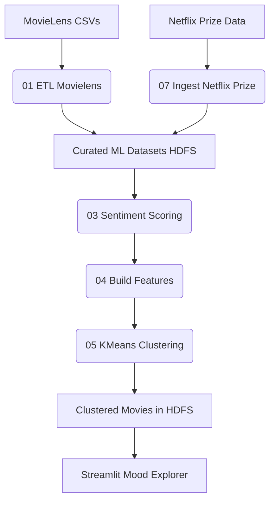

# 🎬 **Netflix Mood-Based Recommendation System**

### *A Big Data + Machine Learning Pipeline using Spark, HDFS, MLlib, VADER & Streamlit*


This project builds an end-to-end **mood-aware movie recommendation engine** combining **MovieLens**, **Netflix Prize**, and curated metadata.
It uses **Apache Spark**, **HDFS**, **MLlib**, **VADER Sentiment**, and a **Streamlit UI** to deliver emotional insights, genre-based filtering, and mood-based movie clusters.

---

# 🌟 **Project Overview**

Modern streaming platforms rely heavily on personalization — but emotion is a missing dimension.
This project introduces **mood-based recommendations**, using sentiment analysis and clustering to group movies by emotional tone.

**Core Capabilities:**

* Distributed ETL on **MovieLens & Netflix Prize**
* Sentiment scoring using **VADER**
* Feature engineering for ML
* **K-Means clustering (MLlib)** to generate mood groups
* **Unified ratings** across datasets
* Streamlit UI with analytics

---

# 🏗 **Architecture**



---

# 🛠 **Technology Stack**

| Layer               | Tools                        |
| ------------------- | ---------------------------- |
| **Compute**         | Apache Spark 3.5, PySpark    |
| **Storage**         | HDFS Distributed File System |
| **ML**              | Spark MLlib (KMeans)         |
| **NLP**             | VADER Sentiment              |
| **UI / Analytics**  | Streamlit                    |
| **Language**        | Python 3.11                  |
| **Version Control** | Git + GitHub                 |

---

# 📂 **Folder Structure**

```
Netflix_Mood_Recommendation_System/
│
├── app/
│   └── app.py                    # Streamlit dashboard UI
│
├── scripts/
│   ├── 01_etl_movielens.py
│   ├── 02_prepare_text.py
│   ├── 03_sentiment_scoring.py
│   ├── 04_build_features.py
│   ├── 05_kmeans_cluster.py
│   ├── 06_generate_recs.py
│   ├── 07_ingest_netflix_prize.py
│   ├── 08_bridge_titles.py
│   ├── 09_unified_ratings.py
│   ├── 10_train_kmeans.py
│   └── 11_verify_kmeans_output.py
│
├── requirements.txt
├── README.md
└── .gitignore
```

---

# 📜 **Pipeline Scripts**

### ** 01_etl_movielens.py**

* Clean & cast ratings, movies, tags
* Fix corrupted timestamps
* Split genres → `genres_array`
* Output: `movielens_ratings`, `movielens_movies`, `movielens_tags`

---

### ** 02_prepare_text.py**

* Clean/normalize text
* Remove punctuation, special chars
* Prepare text for sentiment scoring

---

### ** 03_sentiment_scoring.py**

* Apply **VADER** sentiment
* Add `sentiment_score`
* Output: `movielens_movies_with_sentiment`

---

### ** 04_build_features.py**

* Create feature vector using:

  * sentiment_score
  * release_year
  * categories
* Output: `nf_features`

---

### ** 05_kmeans_cluster.py**

* Train KMeans for k = 3–8
* Pick best K using silhouette score
* Output: `clustered_movies`
* Save model: `/models/kmeans_model`

---

### ** 06_generate_recs.py**

* Generate mood playlists
* Export recommendations tables

---

### ** 07_ingest_netflix_prize.py**

* ETL for Netflix Prize ratings
* Clean timestamps, cast types
* Writes curated Netflix ratings

---

### ** 08_bridge_titles.py**

* Maps Netflix → MovieLens movie IDs
* Creates bridge table for unification

---

### ** 09_unified_ratings.py**

* Combine MovieLens + Netflix Ratings
* Produces master unified ratings table

---

### ** 10_train_kmeans.py**

* Standalone training pipeline
* For tuning/testing KMeans

---

### ** 11_verify_kmeans_output.py**

* Loads clustered movies
* Displays sample cluster results
* Performs QA checks

---

# ⚙️ **Setup & Installation**

### Create environment

```bash
python3 -m venv .venv
source .venv/bin/activate
```

### Install dependencies

```bash
pip install -r requirements.txt
```

### Start Hadoop

```bash
start-dfs.sh
```

---

# 🚀 **Running the Pipeline**
---

### MovieLens ETL

```bash
spark-submit scripts/01_etl_movielens.py
```

---

### Text Preparation (titles / descriptions cleanup)

```bash
spark-submit scripts/02_prepare_text.py
```

---

### Sentiment Scoring (VADER)

```bash
spark-submit scripts/03_sentiment_scoring.py
```

---

### Feature Engineering

```bash
spark-submit scripts/04_build_features.py
```

---

### K-Means Mood Clustering (main clustering job)

```bash
spark-submit scripts/05_kmeans_cluster.py
```

---

### Generate Recommendations / Playlists

```bash
spark-submit scripts/06_generate_recs.py
```

---

### Netflix Prize ETL

```bash
spark-submit scripts/07_ingest_netflix_prize.py
```

---

### Bridge Titles (Netflix IDs ↔ MovieLens IDs)

```bash
spark-submit scripts/08_bridge_titles.py
```

---

### Unified Ratings (MovieLens + Netflix Prize merged)

```bash
spark-submit scripts/09_unified_ratings.py
```

---

### Train K-Means (experimental / tuning script)

```bash
spark-submit scripts/10_train_kmeans.py
```

---

### Verify K-Means Output (QA / debug)

```bash
spark-submit scripts/11_verify_kmeans_output.py
```

---

### 🎨 Streamlit Dashboard (UI)

```bash
streamlit run app/app.py
```

---

If you want, I can also:

* Write a **small shell script** like `run_full_pipeline.sh` that runs these in the correct order automatically, or
* Add a **“Makefile”** so you can just do `make etl`, `make cluster`, `make dashboard`.


---

# 🎨 **Running Streamlit Dashboard**

```bash
streamlit run app/app.py
```

Then open:

```
http://localhost:8502
```

---

# 🗂 **HDFS Storage Map**

```
/projects/netflix_mood/
│
├── raw/
│   ├── movielens/
│   └── netflix_prize/
│
├── curated/
│   ├── movielens_ratings
│   ├── movielens_movies
│   ├── movielens_tags
│   ├── movielens_movies_with_sentiment
│   ├── nf_features
│   ├── clustered_movies
│   ├── unified_ratings
│   └── nf_movies_meta
│
└── models/
    └── kmeans_model
```
--

# **Future Enhancements**

* LLM-based embeddings (OpenAI / BERT) for emotional vectors
* Scene-level mood extraction using Vision Transformers
* Reinforcement learning for dynamic mood recommendations
* Vector databases (FAISS/Pinecone) for similarity search
* Multi-user personalization layer
* Deploy cluster on Spark Standalone / AWS EMR / Databricks

---

# 📄 **License**

This project is released under the **MIT License**.

